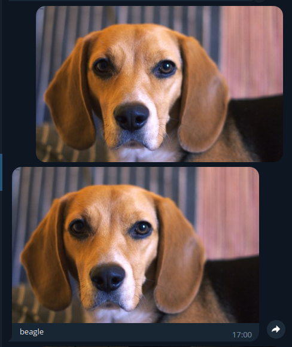

# Телеграм бот, который определеняет породу собаки или кошки по фотографии 

Телеграм бот принимает фотографию собаки или кошки, передает изображение нейросети, присылает обратно это изображение уже с определенной породой.



# Принцип работы
## Нейросеть

Нейросеть использует модель `VGG19`, которая тренируется по датасету `Oxford-IIIT Pet`. Веса модели сохраняются и используются в конечном сервисе. По сути применяется **transfer learning**, что означает, что обучается только последний линейный слой, так как остальные слои уже претренированы.

## Телеграм бот

Телеграм бот использует библиотеку `aiogram` для асинхронного взаимодействия с телеграммом. Бот принимает изображение, передает его брокеру сообщений `Kafka`, откуда нейросеть берет изображение и анализирует, возвращая ответ брокеру. Периодически бот проверят наличие сообщений у брокера: если они есть, то он отправляет их пользователю.


# Установка

## Необходимые зависимости 

```
Java JDK
Python 3.10
Poetry
Kafka
```
## Установка и запуск Kafka

```
wget https://dlcdn.apache.org/kafka/3.3.1/kafka_2.13-3.3.1.tgz
tar -xzf kafka_2.13-3.3.1.tgz
cd kafka_2.13-3.3.1
bin/zookeeper-server-start.sh config/zookeeper.properties
bin/kafka-server-start.sh config/server.properties
```
## Установка пакетов Python

```
poetry update
```
# Запуск
```
poetry run python neurnet.py
poetry run python telegrambot.py
```
